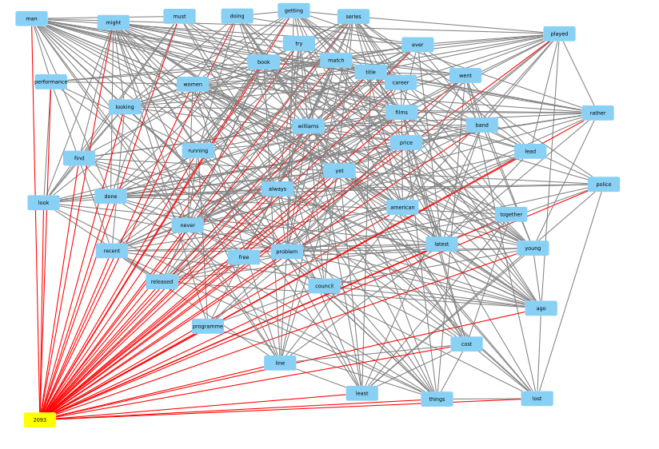
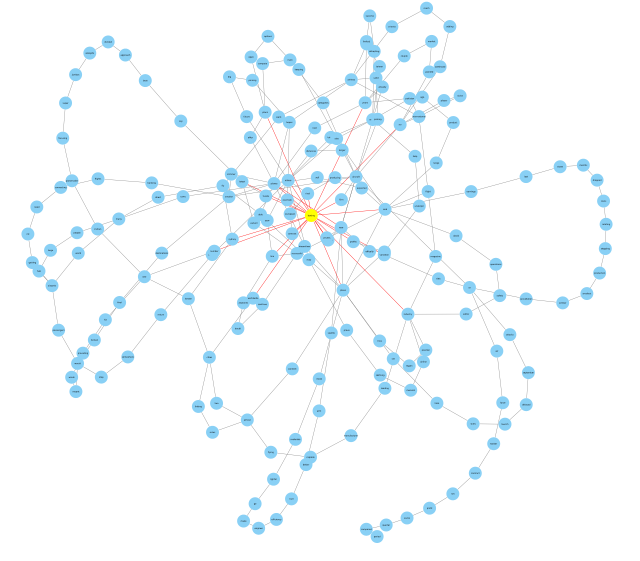

# Graph convolutional neural networks with applications in text classification.
> Master thesis repository

## Table of contents
* [BBC text categorization](#BBC)
* [Graph Convolutional Network](#GCN)
* [TextGCN](#TextGCN)
* [DocumentGCN](#DocumentGCN)
* [Results](#Results)
* [Repository description](#Repository-description)
## BBC text categorization
>Text documents are one of the richest sources of data for businesses.
>
>We’ll use a public dataset from the BBC comprised of 2225 articles, each labeled under one of 5 categories: business, entertainment, politics, sport or tech.
>
>The dataset is broken into 1490 records for training and 735 for testing. The goal will be to build a system that can accurately classify previously unseen news articles into the right category.
>
>The competition is evaluated using Accuracy as a metric.

## Graph Convolutional Network

## TextGCN
This approach was developed by Liang Yao, Chengsheng Mao and Yuan Luo in "[Graph Convolutional Networks for Text Classification](https://arxiv.org/pdf/1809.05679.pdf)". It is a semi-supervised node classification method for heterogeneous graphs. There are two types of nodes: document nodes and token (word) nodes. The connection between token_i and token_j is established based on pointwise mutual information, whereas the strength of the connection between document and word that belongs to that document is determined by tf-idf. The identity matrix is the feature matrix for this graph. A fragment of this graph for a single document and some subset of the words is presented below.

## DocumentGCN

DocumentGCN is a supervised graph classification method. Firstly, all documents are represented as separate graphs. The graphs are built from a set of unique words in a given document and connected based on the co-occurrence property. A word2vec representation of a word is assigned as an attribute of every node.
The considered neural network contained few GCN layers followed by global pooling of feature matrix and dense layer. The Figure below shows a graph representation of a single document from the corpus.

## Results

| Model        | Accuracy (%) | Learning Time (s)  |
|:------------:|:------------:|:------------------:|
| DocumentGCN  |  **98.6**    |     195.95         |
| TextGCN      |    48.4      |     336.73         |
|              |              |                    |
| BERT         |    97.3      |     2045.0         |
| BiLSTM       |    95.0      |     3266.0         |
| NaiveBayes   |    96.4      |   **0.0038**       | 

## Repository description
Steps for reproducing the results:
* run the data/load_raw_data.ipynb -- it will create a feather file with all the documents in single dataframe and it will download the word2vec model.
* TextGCN:
    * prepare the heterogenous word-document graph for the whole corpus with TextGCN/text2graph.ipynb
    * learn the model and make predictions with TextGCN/TextGCN.ipynb
* DocumentGCN
    * prepare the graph for every document in the corpus with DocumentGCN/text2graphs.ipynb
    * learn the model and make predictions with DocumentGCN/DocumentGCN.ipynb
* Non-graph-oriented models are contained in the NB&DNN folder.
   * run: "unzip pretrain_models/simple_word2vec.zip -d pretrain_models/"
   * run the code in the jupyter notebook:
       * tfidfNB -- is a Naive Bayes with tf-idf feature vectors
       * BiLSTM_W2V100 -- contain simple bidirectional lstm model with word2vec features

## Contact
Created by [Robert Benke](https://www.linkedin.com/in/robert-benke-396b56175/) - feel free to contact me!
